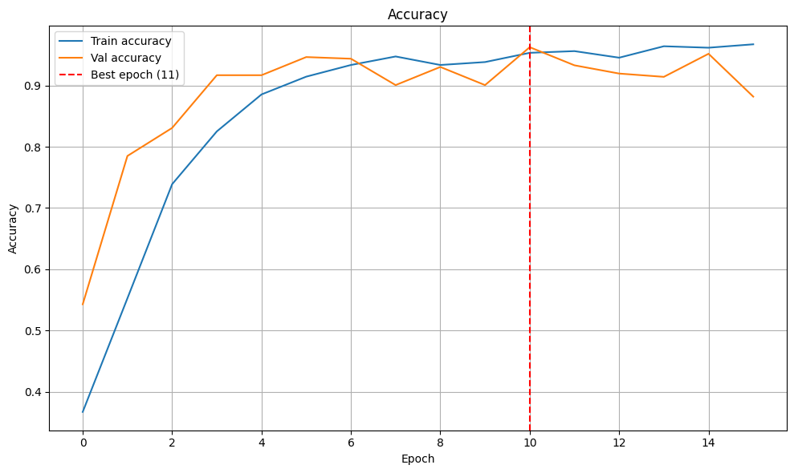

# Rock Paper Scissors CNN Classifier

A Convolutional Neural Network (CNN) model trained to classify hand gestures for Rock, Paper, Scissors using TensorFlow and MediaPipe for real-time detection via webcam.

## Demo


See the model in action detecting hand gestures in real-time.

## Model Accuracy



The model achieves high accuracy on the test set after training with data augmentation.

## Features

- CNN model trained on the Rock Paper Scissors dataset from TensorFlow Datasets
- Real-time hand gesture detection using MediaPipe
- Webcam integration for live prediction
- Data augmentation for improved model generalization

## Installation

1. Clone the repository:
   ```bash
   git clone https://github.com/llucliment/rock_paper_scissors.git
   cd rock_paper_scissors
   ```

2. Install dependencies:
   ```bash
   pip install -r requirements.txt
   ```

## Usage

### Training the Model

Open `rock_paper_scissors_cnn.ipynb` in Jupyter Notebook or Google Colab to train the model. I have personally used the VS Code extension for Google Colab. This way I was able to use my Code Editor while leveraging Colab free GPUs and TPUs. The notebook includes:
- Data loading and preprocessing
- Model architecture with data augmentation layers
- Training with early stopping
- Model evaluation and saving

### Running the Model

To run the trained model with your webcam:

```bash
python run_model_camera.py
```

This will open a fullscreen window showing real-time predictions of Rock, Paper, or Scissors based on your hand gestures.

## Requirements
- Python 3.11 (required for Keras 3.x compatibility)

## Model Details
- Input: 64×64 RGB images
- Architecture: 3 Conv blocks + MaxPool, Dense(128), Dropout(0.6)
- Validation accuracy: ~95%
- Optimizer: Adam (lr=0.001)
- Hyperparameter tuning: Bayesian Optimization via Keras Tuner. (Optional)

## License

This project is licensed under the MIT License - see the [LICENSE](LICENSE) file for details.

